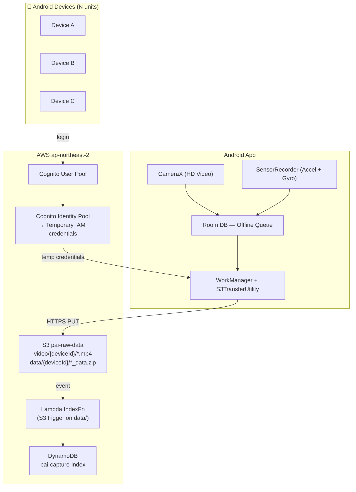

# Project Plan: Android PAI Data Ingestion App

> Last updated: 2026-04-18
> Authors: Andrew Chong (byochong@amazon.com), Hubert Asamer (asamerh@amazon.de)

---

## Overview

This project builds an **Android-based Physical AI data ingestion pipeline into AWS**.
Field engineers use Android smartphones to capture robot operation video and sensor data,
which is automatically uploaded to AWS S3 for downstream use.

**Scope**: This project is responsible for data ingestion only.
Downstream usage (RFM training, RFM inference, labeling, analytics) is out of scope
and handled by separate projects that consume from S3/KVS/KDS.

```
Android → [P1: Batch] or [P2: Streaming] → AWS (S3 / KVS / KDS)
                                                ↓
                            Downstream consumes freely
                            (RFM training, inference, labeling, analytics, ...)
```

---

## Background

This project supports the **PAI Demo Booth** initiative at AWS Korea (Seoul office, 12F/18F).
The booth demonstrates Physical AI capabilities to Korean manufacturing customers
(Hyundai Motor Group, etc.). A repeatable, self-contained data collection tool is needed
to complete the end-to-end PAI pipeline demonstration.

---

## Phase Roadmap

### Phase 1 — Async Batch Ingestion

**Goal**: Simple, reliable data collection. Record → zip → upload to S3.

**Output per recording session: 2 files**

| File | S3 Path | Content |
|------|---------|---------|
| `{prefix}.mp4` | `video/{deviceId}/` | HD video (standalone, reusable) |
| `{prefix}_data.zip` | `data/{deviceId}/` | sensor.csv + metadata.csv |

**zip contents:**
```
{prefix}_data.zip
├── sensor.csv      # timestampMs,accel_x,accel_y,accel_z,gyro_x,gyro_y,gyro_z
└── metadata.csv    # prefix,scenario,location,taskType,deviceId,capturedAt
```

**Key design decisions:**
- mp4 as a standalone file → reusable independently (e.g., YouTube, review)
- CSV for sensor data → standard format for time-series, easy to load in pandas/numpy
- Cognito Identity Pool auth → no credentials embedded in app, per-device S3 isolation
- S3TransferUtility direct PUT → no intermediate Lambda/API GW needed

**Status**: Architecture complete (v2). Remaining implementation:
- [x] `SensorRecorder.kt`: JSON → CSV output ✅ v3 완료
- [x] `MainActivity.kt`: bundle sensor.csv + metadata.csv into `{prefix}_data.zip` ✅ v3 완료
- [x] `LoginActivity.kt`: handle `NEW_PASSWORD_REQUIRED` on first login ✅ v3 완료
- [x] `infra/pai-stack.ts`: update IndexFn trigger to `data/` prefix + parse zip ✅ v3 완료
- [ ] **[진행 예정]** `SettingsActivity.kt`: 자동 분할 간격 설정 (SharedPreferences)
- [ ] **[진행 예정]** `MainActivity.kt`: CountDownTimer 기반 자동 세그먼트 분할 + 연속 업로드
- [ ] **[진행 예정]** `SensorRecorder.kt`: GPS / 자기계 / 기압 등 추가 센서 수집 확장
- [ ] 실기기 배포 검증 (CDK deploy + AwsConfig.kt 실제값 입력 + 실기기 테스트)

---

### Phase 2 — QR Onboarding + Multi-Workspace + Admin Console ✅ 완료 (2026-04-18)

**Goal**: Multi-tenant support with QR-based workspace onboarding and admin management.

**Implemented components:**

| Component | Status | Details |
|-----------|--------|---------|
| IAM Policy 강화 | ✅ | S3 prefix `video/{cognito-sub}/*` 로 제한 |
| IndexFn userSub 저장 | ✅ | DynamoDB에 `userSub` 필드 추가 |
| InviteStack | ✅ | DynamoDB `pai-invite-tokens` + ValidateInviteFn + ExtendInviteFn + RevokeInviteFn |
| AdminStack | ✅ | Secrets Manager + Admin Cognito User Pool + CodeBuild + CloudFront |
| Admin Console (React) | ✅ | Dashboard (invite + member 목록), QR 생성, TTL date picker, 멤버 테이블 |
| Android Workspace Manager | ✅ | WorkspaceConfig, WorkspaceManager, QRScanActivity, WorkspaceListActivity |
| Email 인증 플로우 | ✅ | `requireEmailVerification` 지원, confirmSignUp dialog |

**Deployed endpoints:**
- Admin Console: `https://d1pq4sswfuonbh.cloudfront.net`
- Admin API: `https://3bf81smt2f.execute-api.ap-northeast-2.amazonaws.com/prod/`
- Invite API: `https://fa0xzwjcme.execute-api.ap-northeast-2.amazonaws.com/prod/`

---

### Phase 3 — Near-Realtime Streaming Ingestion

**Goal**: Stream video and sensor data to AWS in near-realtime for latency-sensitive downstream use cases.

**Design (planned):**

| Data | AWS Service | Notes |
|------|-------------|-------|
| Video frames | Kinesis Video Streams (KVS) | H.264 fragment streaming via KVS Producer SDK |
| IMU sensor data | Kinesis Data Streams (KDS) | High-frequency PutRecord calls |

**In-app toggle**: P1 (Batch) and P2 (Streaming) modes coexist in the same app.

**Status**: Not started. Depends on P1 completion.

---

## Architecture (Phase 1)



---

## Tech Stack

| Layer | Technology |
|-------|-----------|
| Android app | Kotlin, CameraX, AWS Android SDK v2, Room, WorkManager |
| Auth | Amazon Cognito User Pool + Identity Pool |
| Storage | Amazon S3 (SSE-S3, 365-day lifecycle) |
| Indexing | AWS Lambda (Node.js 20) + Amazon DynamoDB |
| IaC | AWS CDK (TypeScript) |
| Min Android SDK | API 26 (Android 8.0) |

---

## Repository

GitLab: `git@ssh.gitlab.aws.dev:iss-pai/physical-ai-mobile-app-for-aws.git`  
Linked as submodule in `bdsa-knowledge-base/projects/physical-ai-mobile-app/`

```
physical-ai-mobile-app-for-aws/
├── PLAN.md              ← this file
├── README.md            ← technical setup guide
├── app/                 ← Android app (Kotlin)
└── infra/               ← AWS CDK (TypeScript)
```

---

## Open Questions / Discussion Points

- [ ] **Scenarios to support**: Which robot operation scenarios should be in the spinner? (logistics, assembly, welding, autonomous, inspection — add more?)
- [x] **Sensor sampling rate**: configurable (Normal ~5Hz / Game ~50Hz / Fastest ~200Hz) — 구조 설계 완료
- [x] **Video quality**: configurable (720p / 1080p / 4K) — 구조 설계 완료
- [ ] **Phase 2 priority**: When should we start P2? What's the target latency requirement?
- [x] **AWS account**: 한국 `ap-northeast-2`, 독일(Hubert) `eu-central-1`
- [ ] **Auto-segment interval**: Hubert와 논의 완료 — 구현 예정 (30초 ~ 45분 설정 가능)
- [ ] **Additional sensors**: GPS / 자기계 / 기압 등 수집 범위 확장 여부 Hubert와 확인 필요
- [ ] **App distribution**: APK 직접 배포 vs MDM vs Play Store internal track
