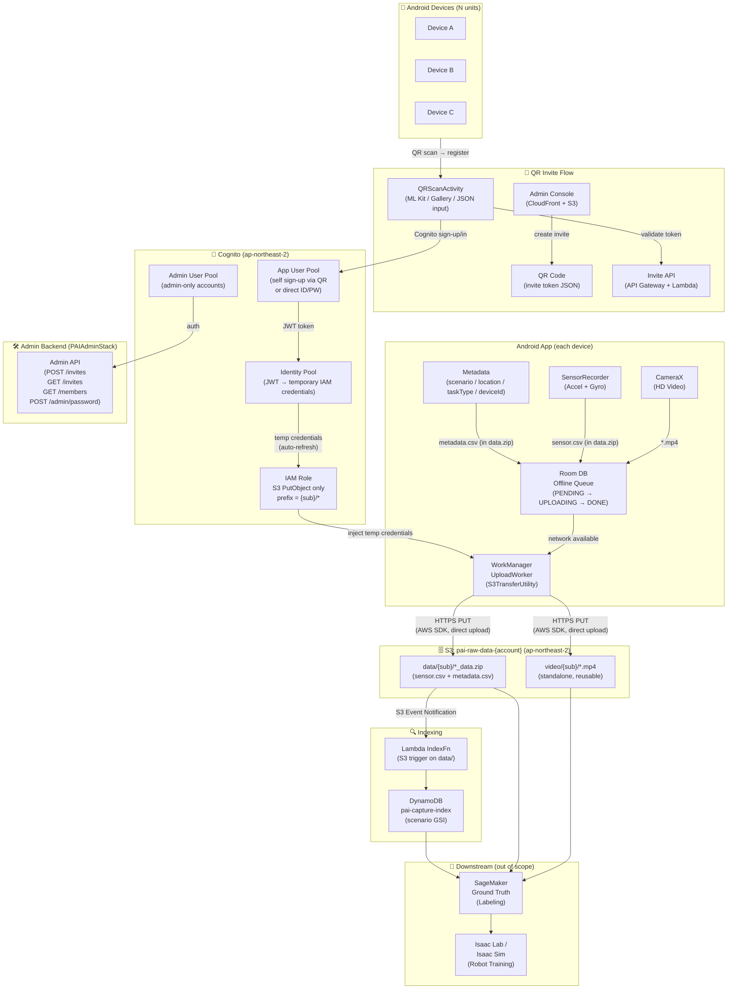

# Android PAI Data Ingestion App

An Android app + AWS backend for collecting Physical AI training data.
Field engineers use their smartphones to capture robot operation video and sensor data, which is automatically uploaded to S3.

For the project plan and roadmap, see [PLAN.md](./PLAN.md).

---

## System Architecture



### Auth Flow

| Step | Description |
|------|-------------|
| ① QR Scan | Field engineer scans QR from Admin Console (or pastes JSON / picks from gallery) |
| ② Token Validation | App calls Invite API to validate the token and get workspace config |
| ③ Sign Up / Login | App registers or logs in with Cognito User Pool using email + password |
| ④ Credential exchange | Identity Pool converts JWT → temporary IAM credentials (auto-refresh) |
| ⑤ Direct upload | S3TransferUtility PUTs directly to S3 using temporary credentials |
| ⑥ Device isolation | S3 key prefix = `{type}/{cognito sub}/...` — data separated per user/device |
| ⑦ Offline | Room DB queues captures when offline; WorkManager retries on reconnect |

### Stacks Overview

| CDK Stack | Description |
|-----------|-------------|
| `PAIDataStack` | S3, App Cognito User Pool + Identity Pool, DynamoDB capture index, Lambda index trigger |
| `PAIInviteStack` | DynamoDB invite tokens, Lambda (validate/extend/revoke), Invite API Gateway |
| `PAIAdminStack` | Admin Cognito User Pool, Admin Console (S3+CloudFront+CodeBuild), Admin API Gateway, Lambda (create-invite, list-invites, list-members, change-password) |

---

## Directory Structure

```
physical-ai-mobile-app/
├── PLAN.md
├── README.md
├── app/src/main/java/com/amazon/paidatacollector/
│   ├── AwsConfig.kt                  # Paste CDK output values here
│   ├── PAIApp.kt                     # Application class + AWSMobileClient init
│   ├── data/Database.kt              # Room DB (CaptureItem, CaptureDao)
│   ├── sensor/SensorRecorder.kt      # IMU capture → CSV
│   ├── upload/UploadWorker.kt        # WorkManager + S3TransferUtility
│   └── ui/
│       ├── LoginActivity.kt          # Login screen (launcher) + QR scan button
│       ├── MainActivity.kt           # Camera UI + recording control
│       ├── QRScanActivity.kt         # QR scan (camera / JSON input / gallery)
│       ├── ScanOverlayView.kt        # Custom view: scan guide frame overlay
│       ├── SettingsActivity.kt       # App settings
│       └── WorkspaceListActivity.kt  # Workspace list + selection
└── infra/
    ├── bin/infra.ts                  # CDK app entry point (--context mode=dev|prod)
    ├── lib/
    │   ├── pai-stack.ts              # PAIDataStack: S3, Cognito, DynamoDB, Lambda
    │   ├── pai-invite-stack.ts       # PAIInviteStack: invite tokens + Invite API
    │   ├── pai-admin-stack.ts        # PAIAdminStack: admin console + Admin API
    │   └── pai-viewer-stack.ts       # PAIViewerStack: data viewer (optional)
    ├── lambda/
    │   ├── validate-invite/          # POST /invite/validate
    │   ├── extend-invite/            # POST /invite/extend
    │   ├── revoke-invite/            # POST /invite/revoke
    │   ├── create-invite/            # POST /invites (admin)
    │   ├── list-invites/             # GET /invites (admin)
    │   ├── change-password/          # POST /admin/password
    │   ├── list-captures/            # GET /captures
    │   ├── get-video-url/            # GET /video-url
    │   ├── get-sensor-data/          # GET /sensor-data
    │   ├── get-labels/               # GET /labels
    │   └── update-labels/            # PUT /labels
    └── admin/src/pages/
        ├── DashboardPage.tsx         # Invite list + "View QR" modal
        ├── CreateQRPage.tsx          # Create new invite QR
        └── ChangePasswordPage.tsx    # Change admin password
```

---

## Quick Start

### 1. Deploy AWS Backend

```bash
cd infra
npm install

# First time only
npx cdk bootstrap aws://ACCOUNT_ID/ap-northeast-2

# Deploy all stacks (dev mode = default)
npx cdk deploy --all

# Or deploy individually
npx cdk deploy PAIDataStack
npx cdk deploy PAIInviteStack
npx cdk deploy PAIAdminStack
```

Example CDK output:
```
PAIDataStack.BucketName       = pai-raw-data-428925521485
PAIDataStack.UserPoolId       = ap-northeast-2_MLxeZLXyY
PAIDataStack.UserPoolClientId = 64d10g6v0d1au6dho0vli0108e
PAIDataStack.IdentityPoolId   = ap-northeast-2:82d41af6-be83-420a-ab89-49eafcc66dd4
PAIAdminStack.AdminConsoleURL = https://d1pq4sswfuonbh.cloudfront.net
PAIAdminStack.AdminApiEndpoint = https://3bf81smt2f.execute-api.ap-northeast-2.amazonaws.com/prod/
PAIInviteStack.InviteApiEndpoint = https://fa0xzwjcme.execute-api.ap-northeast-2.amazonaws.com/prod/
```

### 2. Configure Android App

Paste CDK output values into [AwsConfig.kt](app/src/main/java/com/amazon/paidatacollector/AwsConfig.kt):

```kotlin
object AwsConfig {
    const val REGION              = "ap-northeast-2"
    const val BUCKET_NAME         = "pai-raw-data-428925521485"
    const val USER_POOL_ID        = "ap-northeast-2_MLxeZLXyY"
    const val USER_POOL_CLIENT    = "64d10g6v0d1au6dho0vli0108e"
    const val IDENTITY_POOL_ID    = "ap-northeast-2:82d41af6-..."
    const val INVITE_API_ENDPOINT = "https://fa0xzwjcme.execute-api.ap-northeast-2.amazonaws.com/prod/"
}
```

### 3. Build Android APK

```bash
cd physical-ai-mobile-app
./gradlew assembleDebug
# APK: app/build/outputs/apk/debug/app-debug.apk

# Install on connected device
adb install -r app/build/outputs/apk/debug/app-debug.apk
```

### 4. Create QR Invite and Register

1. Open Admin Console: `https://d1pq4sswfuonbh.cloudfront.net`
2. Log in with admin credentials (see [Admin Console](#admin-console) below)
3. Go to **Create QR** → fill in workspace name, max uses, time window
4. Download the QR code image
5. On the Android device: open app → tap **QR Code Scan** → scan the QR
6. Enter email + password to register → workspace appears in workspace list

---

## Email Verification

Cognito sends a verification code to the registered email during sign-up.

### Dev Mode (Default)

SES is in **Sandbox** mode by default — only pre-verified addresses can receive mail.

**To test email verification in dev:**
1. AWS Console → **SES** → **Verified identities** → **Create identity**
2. Select **Email address**, enter your email, confirm the verification email
3. Use that email when registering in the app

```bash
# Deploy in dev mode (default — no change needed)
npx cdk deploy PAIDataStack
# or explicitly:
npx cdk deploy PAIDataStack --context mode=dev
```

### Prod Mode

> **Prerequisite**: SES must be out of Sandbox before deploying with `mode=prod`.

**Steps to go production:**
1. Open an AWS Support case: *Service Limit Increase → SES Sending Limits → Request production access*
2. Wait for approval (typically 1–2 business days)
3. In `infra/lib/pai-stack.ts`, update the `SES_FROM_EMAIL` constant (line ~62) to a domain you own:
   ```typescript
   const SES_FROM_EMAIL = 'noreply@yourdomain.com'; // replace with your actual domain
   const SES_REPLY_TO   = 'noreply@yourdomain.com';
   ```
4. Deploy with `mode=prod`:
   ```bash
   npx cdk deploy PAIDataStack --context mode=prod
   ```
5. After deploy, go to **SES → Verified identities → `noreply@yourdomain.com`** and add the DKIM / SPF DNS records shown in the console

In prod mode, CDK creates an `AWS::SES::EmailIdentity` and wires Cognito to use SES for all outbound email — removing the 50/day cap and allowing any email address to receive verification codes.

---

## Data Viewer

A web-based viewer for browsing uploaded captures, playing back video, and inspecting sensor data. Deployed as a CloudFront-hosted React SPA, backed by API Gateway + Lambda.

| Item | Value |
|------|-------|
| Viewer URL | `https://d2gup9k4vdzl3b.cloudfront.net` |
| Viewer API | `https://cn1u8vyvj7.execute-api.ap-northeast-2.amazonaws.com/prod/` |
| Cognito Login URL | `https://pai-viewer-428925521485.auth.ap-northeast-2.amazoncognito.com/login?client_id=ik3b7lav78qs7k19rjge60chc&response_type=code&scope=openid+email+profile&redirect_uri=https://d2gup9k4vdzl3b.cloudfront.net` |
| Viewer Client ID | `ik3b7lav78qs7k19rjge60chc` |

### Login

The viewer uses the **App User Pool** (same credentials as the Android app). Log in with the Cognito Hosted UI:

1. Go to the Viewer URL: `https://d2gup9k4vdzl3b.cloudfront.net`
2. You will be redirected to the Cognito Hosted UI login page
3. Enter the email and password used when registering via QR code in the Android app
4. After login you are redirected back to the viewer

> Only users registered via the Android app QR flow appear in the App User Pool.
> Admin Console accounts are in a separate pool and cannot access the viewer.

### Features

#### Capture List

After login, the main page shows all captures recorded by your account (user isolation by Cognito sub):

- **Filters**: filter by label status (pending / in-review / approved / rejected) or scenario
- **Stats sidebar**: total / pending / approved counts
- **Capture card**: shows scenario, date, location, device, task type, and label tags

#### Video Viewer (작업 3)

Click any capture card to open the detail view. The left pane shows the video player:

- HTML5 video with full playback controls
- **Speed control**: 0.25× / 0.5× / 1× / 1.5× / 2×
- Presigned S3 URL (valid 1 hour) — fetched automatically on open

#### Sensor Data Viewer (작업 4)

The right pane of the detail view shows sensor charts loaded from the `_data.zip`:

- **8 chart groups**: Accelerometer, Gyroscope, Magnetometer, Gravity, Linear Acceleration, Rotation Vector, Environmental (pressure / light / proximity), GPS
- **Click-to-seek**: click any point on a chart to jump the video to that timestamp
- **Playhead sync**: a yellow vertical line follows video playback across all charts in real time

#### Label Editor

In the same detail view, assign quality / status / tags / issues / notes and save back to DynamoDB via the API.

### Redeploy Viewer

The viewer is auto-deployed by CodeBuild whenever CDK deploys `PAIDataStack`. To trigger a manual redeploy:

```bash
aws codebuild start-build \
  --project-name "PAIDataStack-ViewerStackNestedStackViewerStackNestedStackResourceB9491F40-ZST220CYJNNM-viewer-build" \
  --region ap-northeast-2
```

To rebuild after local source changes: upload source to S3 then start a build:

```bash
cd infra
npx cdk deploy PAIDataStack   # re-uploads viewer/src and triggers CodeBuild automatically
```

---

## Admin Console

URL: `https://d1pq4sswfuonbh.cloudfront.net`

### Login

The admin password is stored in AWS Secrets Manager:

```bash
aws secretsmanager get-secret-value \
  --secret-id arn:aws:secretsmanager:ap-northeast-2:428925521485:secret:pai-admin-password-428925521485-KPtlHf \
  --region ap-northeast-2 \
  --query SecretString --output text
```

### Features

| Feature | Description |
|---------|-------------|
| **Dashboard** | Lists all invite tokens (active / expired / revoked). Click **View QR** on an active invite to display or re-download the QR code. |
| **Create QR** | Creates a new invite token. Options: workspace name, max uses, time window (hours), require email verification. |
| **Change Password** | Changes the admin Cognito password and syncs it to Secrets Manager. Enforces 12+ chars, uppercase, digit, special character. |

### Create QR Options

| Field | Description |
|-------|-------------|
| `workspaceName` | Label shown in the Android app workspace list |
| `maxUses` | Maximum number of times the QR can be used to register |
| `timeWindow` | Expiry in hours from creation time |
| `requireEmailVerification` | If true, Cognito sends a verification code to the registered email |

---

## Collected Data Format

Each recording session produces **2 files**, stored under a per-user S3 prefix (`{cognito sub}`):

| File | S3 Path | Content |
|------|---------|---------|
| `{prefix}.mp4` | `video/{sub}/` | HD video — standalone, reusable |
| `{prefix}_data.zip` | `data/{sub}/` | sensor.csv + metadata.csv |

**zip contents:**
```
{prefix}_data.zip
├── sensor.csv      # timestampMs, accel_x, accel_y, accel_z, gyro_x, gyro_y, gyro_z
└── metadata.csv    # prefix, scenario, location, taskType, deviceId, capturedAt
```

`prefix` format: `yyyyMMdd_HHmmss`

---

## Troubleshooting

### Debugging Upload Failures

```bash
# Clear old logs and monitor in real-time
adb logcat -c
adb logcat '*:I' | grep -E '(UploadWorker|MainActivity|PAIApp|S3|Transfer|AWSMobile)'
```

Record a video → stop → wait ~30s for upload. Expected log sequence:

```
I MainActivity: Enqueuing upload for prefix: 20260409_124715_001
I UploadWorker: UploadWorker started. Run attempt: 0
I UploadWorker: Found 2 pending items to upload
I UploadWorker: Starting upload for item 1: video/{sub}/20260409_124715_001.mp4
I UploadWorker: Successfully uploaded item 1
I UploadWorker: Upload work completed. AnyFailed: false
I MainActivity: ✓ Upload completed successfully
```

#### Common Issues

| Error Log | Problem | Solution |
|-----------|---------|----------|
| `403 Access Denied` on S3 PUT | IAM policy prefix mismatch | Check `cognito-identity.amazonaws.com:sub` principal tag mapping in `pai-stack.ts` |
| `No valid credentials` | Session expired | Re-login or re-register in the app |
| `Upload work failed` immediately | WorkerFactory not registered | Check `PAIApp.kt` implements `Configuration.Provider` |
| `KeyRequiresUpgrade` warnings | Android OS update | Harmless, ignore |
| QR scan produces no result | Poor lighting or blurry | Use "JSON 입력" or "갤러리 선택" as alternative |
| Email verification code not received | SES Sandbox | Register your email in SES Verified Identities (see [Email Verification](#email-verification)) |

### Verify S3 Upload

```bash
# List uploaded videos
aws s3 ls s3://pai-raw-data-428925521485/video/ --recursive --human-readable --region ap-northeast-2

# List uploaded data zips
aws s3 ls s3://pai-raw-data-428925521485/data/ --recursive --human-readable --region ap-northeast-2

# Check DynamoDB capture index
aws dynamodb scan --table-name pai-capture-index-1 \
  --region ap-northeast-2 \
  --query "Items[*].{pk:pk.S,capturedAt:capturedAt.N}"
```

### Check Invite Tokens

```bash
# List all invite tokens
aws dynamodb scan --table-name pai-invite-tokens \
  --region ap-northeast-2 \
  --query "Items[*].{pk:pk.S,isActive:isActive.BOOL,usedCount:usedCount.N}"
```

### Redeploy Admin Console Manually

If the console content is stale after `cdk deploy`:

```bash
aws codebuild start-build \
  --project-name PAIAdminStack-admin-build \
  --region ap-northeast-2
```
